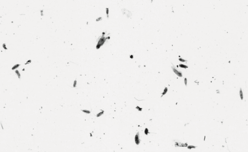
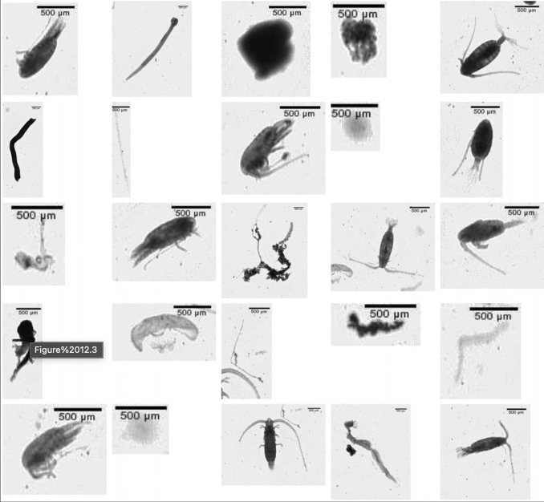

```{r setup, include=FALSE}
knitr::opts_chunk$set(echo = TRUE)
```

## Introduction

Les organismes planctoniques sont échantillonnés à l'aide d'un filet à plancton. Anciennement, les organismes collectés étaient identifiés et dénombrés sous binoculaire. Cette approche était très fastidieuse. Des outils comme le ZOOSCAN ont été développés afin d'aider les scientifiques à compter, mesurer et identifier les organismes [@2004grosjean]. Les échantillons prélevés sont numérisés afin d'obtenir une image. La figure ci-dessous présente une petite portion d'un scan.



Portion d'une image obtenue lors d'un scan d'un échantillon. Figure extraite de @2014grosjean

Chaque particule sur l'image d'origine va être découpée et extraite. Elles sont nommées vignettes. De nombreuses mesures peuvent être réalisées. Le tableau `zooplankton` du package {data.io} comprend 18 variables mesurées (ou calculées) sur 1262 vignettes. Ces observations ont été obtenues suite à l'analyse d'image du zooplancton provenant de Tuléar (Madagascar).



Assemblage de 25 vignettes. Figure extraite de @2014grosjean

Chaque vignette est labélisée. C'est-à-dire qu'un expert de la taxonomie du plancton a identifié les organismes présents. La variable `class` vous informe sur cette identification.

Dans le cadre du cours de Science des données III, vous apprendrez à utiliser des données similaires afin de faire classer un ordinateur à votre place. Il s'agit de la classification supervisée.

## Objectif

Ce projet est un projet **individuel**, **court** et **cadré**. Il doit être terminé le **31 octobre à 15h30**. Son template se trouve à <https://github.com/BioDataScience-Course/A03Ia_distributions>

L'objectif est de compléter votre apprentissage dans l'analyse de la distribution d'une variable en réalisant différents types de graphiques :

-   Histogramme
-   Graphique de densité
-   Diagramme en violon

## Consignes

Au sein du fichier `zooplankton_notebook.Rmd` qui se trouve dans le dossier `docs`, réalisez et décrivez les différents graphiques demandés.

Chaque variable du jeu de données `zooplankton` du package {data.io} est explicitée dans la page d'aide associée à ce dernier.

    ?zooplankton

## Notes

### Plagiat

N'oubliez pas que le plagiat est interdit. Citez vos sources.

### Entraide

L'entraide est encouragée. Vous devez cependant citer les personnes qui ont contribué à votre projet. Utilisez les "block quotes" sous un chunk ou sous un paragraphe pour spécifier vos collaborateurs. Les "block quotes" sont des paragraphes Markdown commençants par un signe plus grand que suivi d'une espace (\>). Vous pouvez aussi y indiquer d'autres remarques, par exemple, la difficulté ou le temps nécessaire pour remplir une section. Terminez avec un "block quote" avant la section bibliographie où vous indiquez le temps total nécessaire, le temps supplémentaire qu'il faudrait éventuellement, et vos suggestions relatives à ce projet pour l'améliorer dans le futur. Voici un exemple de "block quote"

> Adapté de Grosjean, en collaboration avec Engels (j'aurais pu me débrouiller ici, mais j'aurais perdu trop de temps sur ce chunk)

## Bibliographie
